<div align="center">
  <h1>🚀 Crewmate</h1>
  <p><b>Your Gamified AI Co-Founder Console</b></p>
  
  [](https://fastapi.tiangolo.com/)
  [](https://reactjs.org/)
  [](https://www.postgresql.org/)
</div>

---

**Crewmate** is a next-generation gamified AI co-founder console. Built with a server-authoritative trust engine, real agent execution loops, and secure Firebase authentication, Crewmate brings your digital teammate to life. Level up your AI teammate, assign missions, and build the future together!

## ✨ Features

- **🎮 Server-Authoritative Trust Engine:** The XP and autonomy level of your AI teammate are rigorously verified on the server. Level ups happen organically as missions succeed.
- **🤖 Real Agent Execution Loop:** Utilizing Groq, the agent plans and executes tasks against sandboxed tools.
- **🛡️ Boundary-Gated Autonomy:** Objectives outside the teammate's current autonomy level become pending `ApprovalQuests` instead of running silently. You remain in control.
- **📜 Append-Only Mission Audit Log:** Track everything your AI co-founder does. Missions are securely logged and cannot be tampered with.
- **🔐 Secure Authentication:** Integrated with Firebase Auth and Admin SDK for bulletproof token verification.

## 🏗️ Architecture

Crewmate is divided into two core parts:

1. **Frontend:** A React + Vite app providing the sleek, gamified console interface.
2. **Backend:** An asynchronous FastAPI + PostgreSQL + SQLAlchemy 2.0 backend powering the trust engine, agent logic, and mission audits.

```mermaid
flowchart LR

subgraph group_frontend["Console frontend"]
  node_app["App views<br/>[App.tsx]"]
  node_authctx["Auth context<br/>[AuthContext.tsx]"]
  node_console["Console<br/>[Console.tsx]"]
  node_onboard["Onboarding"]
  node_connect["Google connect"]
  node_apiclient["API client<br/>[api.ts]"]
end

subgraph group_api["API and domain"]
  node_apiapp["FastAPI app<br/>[main.py]"]
  node_auth["Auth endpoints<br/>[router.py]"]
  node_workspaces["Workspace service<br/>[service.py]"]
  node_teammates["Teammate service<br/>[service.py]"]
  node_missionapi["Mission audit API<br/>[router.py]"]
  node_skills["Skill catalog<br/>[router.py]"]
end

subgraph group_execution["Agent and trust"]
  node_agentroutes["Agent endpoints<br/>[router.py]"]
  node_engine["Execution engine<br/>[engine.py]"]
  node_tools["Sandboxed tools<br/>[tools.py]"]
  node_questsapi["Approval endpoints<br/>[router.py]"]
  node_questservice["Approval service<br/>[service.py]"]
end

subgraph group_state["Persistence and integrations"]
  node_googleoauth["Google OAuth<br/>[router.py]"]
  node_database[("SQL database<br/>[database.py]")]
  node_models["Domain records"]
end

node_founder(("Founder"))
node_firebase{{"Firebase Auth"}}
node_groq{{"Groq"}}

node_founder -->|"uses console"| node_app
node_app -->|"reads auth state"| node_authctx
node_app -->|"shows workspace"| node_console
node_app -->|"starts setup"| node_onboard
node_app -->|"requests connection"| node_connect
node_authctx -->|"authenticates with"| node_firebase
node_authctx -->|"syncs identity"| node_apiclient
node_console -->|"calls API"| node_apiclient
node_onboard -->|"submits setup"| node_apiclient
node_connect -->|"starts OAuth"| node_apiclient
node_apiclient -->|"sends requests"| node_apiapp
node_apiapp -->|"dispatches auth"| node_auth
node_apiapp -->|"dispatches workspace"| node_workspaces
node_apiapp -->|"dispatches teammate"| node_teammates
node_apiapp -->|"dispatches missions"| node_missionapi
node_apiapp -->|"dispatches skills"| node_skills
node_apiapp -->|"dispatches agent"| node_agentroutes
node_apiapp -->|"dispatches approvals"| node_questsapi
node_apiapp -->|"dispatches OAuth"| node_googleoauth
node_auth -->|"reads and writes"| node_database
node_workspaces -->|"reads and writes"| node_database
node_teammates -->|"reads and updates"| node_database
node_skills -->|"reads and updates"| node_database
node_missionapi -->|"reads missions"| node_database
node_agentroutes -->|"invokes execution"| node_engine
node_engine -->|"runs plan steps"| node_tools
node_engine -.->|"plans with"| node_groq
node_engine -->|"records run and mission"| node_database
node_engine -->|"creates approval quest"| node_questservice
node_questsapi -->|"handles resolution"| node_questservice
node_questservice -->|"executes approved plan"| node_tools
node_questservice -->|"records quest and mission"| node_database
node_questservice -->|"awards XP"| node_teammates
node_googleoauth -->|"requires identity"| node_firebase
node_googleoauth -->|"stores tokens"| node_database
node_database -->|"persists records"| node_models

click node_app "https://github.com/krutarth3238/crewmate/blob/main/frontend/src/App.tsx"
click node_authctx "https://github.com/krutarth3238/crewmate/blob/main/frontend/src/context/AuthContext.tsx"
click node_console "https://github.com/krutarth3238/crewmate/blob/main/frontend/src/components/Console.tsx"
click node_onboard "https://github.com/krutarth3238/crewmate/blob/main/frontend/src/components/OnboardingModal.tsx"
click node_connect "https://github.com/krutarth3238/crewmate/blob/main/frontend/src/components/GoogleConnectView.tsx"
click node_apiclient "https://github.com/krutarth3238/crewmate/blob/main/frontend/src/lib/api.ts"
click node_apiapp "https://github.com/krutarth3238/crewmate/blob/main/backend/app/main.py"
click node_auth "https://github.com/krutarth3238/crewmate/blob/main/backend/app/auth/router.py"
click node_workspaces "https://github.com/krutarth3238/crewmate/blob/main/backend/app/workspaces/service.py"
click node_teammates "https://github.com/krutarth3238/crewmate/blob/main/backend/app/teammates/service.py"
click node_missionapi "https://github.com/krutarth3238/crewmate/blob/main/backend/app/missions/router.py"
click node_skills "https://github.com/krutarth3238/crewmate/blob/main/backend/app/skills/router.py"
click node_agentroutes "https://github.com/krutarth3238/crewmate/blob/main/backend/app/agent/router.py"
click node_engine "https://github.com/krutarth3238/crewmate/blob/main/backend/app/agent/engine.py"
click node_tools "https://github.com/krutarth3238/crewmate/blob/main/backend/app/agent/tools.py"
click node_questsapi "https://github.com/krutarth3238/crewmate/blob/main/backend/app/quests/router.py"
click node_questservice "https://github.com/krutarth3238/crewmate/blob/main/backend/app/quests/service.py"
click node_googleoauth "https://github.com/krutarth3238/crewmate/blob/main/backend/app/google_oauth/router.py"
click node_database "https://github.com/krutarth3238/crewmate/blob/main/backend/app/database.py"
click node_models "https://github.com/krutarth3238/crewmate/tree/main/backend/app/models"

classDef toneNeutral fill:#f8fafc,stroke:#334155,stroke-width:1.5px,color:#0f172a
classDef toneBlue fill:#dbeafe,stroke:#2563eb,stroke-width:1.5px,color:#172554
classDef toneAmber fill:#fef3c7,stroke:#d97706,stroke-width:1.5px,color:#78350f
classDef toneMint fill:#dcfce7,stroke:#16a34a,stroke-width:1.5px,color:#14532d
classDef toneRose fill:#ffe4e6,stroke:#e11d48,stroke-width:1.5px,color:#881337
classDef toneIndigo fill:#e0e7ff,stroke:#4f46e5,stroke-width:1.5px,color:#312e81
classDef toneTeal fill:#ccfbf1,stroke:#0f766e,stroke-width:1.5px,color:#134e4a
class node_app,node_authctx,node_console,node_onboard,node_connect,node_apiclient toneBlue
class node_apiapp,node_auth,node_workspaces,node_teammates,node_missionapi,node_skills toneAmber
class node_agentroutes,node_engine,node_tools,node_questsapi,node_questservice toneMint
class node_googleoauth,node_database,node_models toneRose
class node_founder,node_firebase,node_groq toneIndigo
```



## 🚀 Quick Start

### 1. Backend Setup

Navigate to the `backend` directory:
```bash
cd backend
```
1. Set up a virtual environment and install dependencies:
   ```bash
   python3 -m venv .venv
   source .venv/bin/activate
   pip install -r requirements.txt
   ```
2. Configure your environment:
   ```bash
   cp .env.example .env
   ```
   *Make sure to set `DATABASE_URL` and `FIREBASE_SERVICE_ACCOUNT_PATH`.*
3. Run migrations and start the server:
   ```bash
   alembic upgrade head
   uvicorn app.main:app --reload --port 8000
   ```
   *The backend will be available at `http://localhost:8000/docs`.*

### 2. Frontend Setup

Navigate to the `frontend` directory:
```bash
cd frontend
```
1. Install dependencies:
   ```bash
   npm install
   ```
2. Configure your environment variables in `.env`.
3. Start the dev server:
   ```bash
   npm run dev
   ```

## 🎮 How it Works

When you spin up Crewmate, you aren't just logging into a dashboard—you are interacting with an AI co-founder that grows with your project. The more tasks you collaborate on, the more XP your agent earns. High-risk missions require your manual approval, while tasks within the agent's current autonomy level are executed automatically. 

Build the future, together! 🌌
